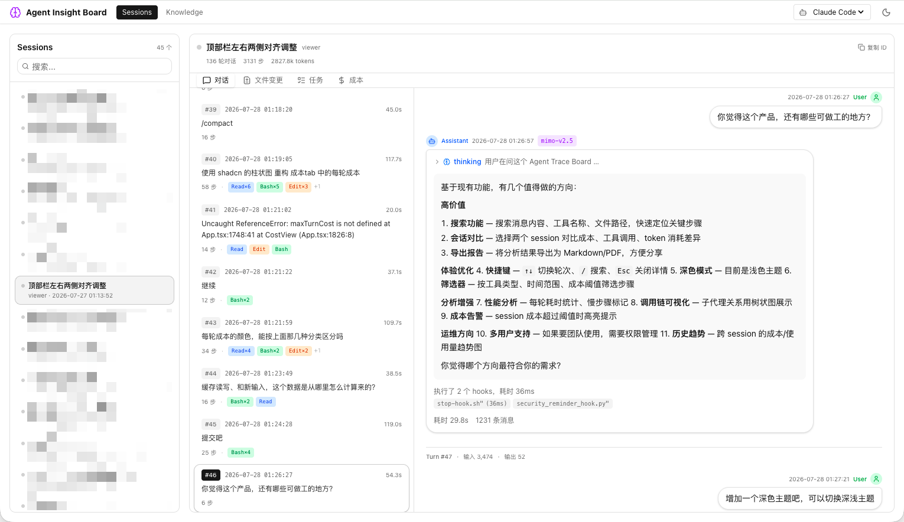

# Agent Insight Board

从 AI Agent 执行过程中萃取可复用知识的工具。

实时监控和事后分析 Claude Code 等 Coding Agent 的执行过程,提取、管理、同步知识到 CLAUDE.md 文件。



## 功能特性

### 实时监控
- **WebSocket 推送** — 自动发现新 session 和 turn,无需手动刷新
- **智能滚动** — 新内容添加时自动滚动到底部,用户向上浏览时不打断
- **Session 持久化** — 刷新页面保持选中状态,复制 Session ID 方便分享

### 对话追踪
- **双向联动** — 中栏点击跳转右侧,右侧滚动同步中栏高亮
- **Turn 追踪** — IntersectionObserver 精确追踪当前可见 turn
- **丰富的 Step 展示** — 支持 thinking、tool_use、tool_result、text、image、compact(上下文压缩摘要)等内容块
- **工具可视化** — Bash/Read/Write/Edit/Glob/Grep/Agent/WebFetch/WebSearch 等工具按类型着色,Edit 显示行级 diff
- **Markdown 渲染** — 支持代码高亮、GFM 语法,图片可点击放大预览

### 详情面板四个 Tab
- **对话** — 三栏布局(Session → Turn → 详情),展示完整对话和工具调用
- **文件变更** — 按 message 聚合文件改动,左侧变更列表 + 右侧 unified diff,支持新建文件标记
- **任务** — TodoWrite 任务的状态轨迹时间线,展示创建/进行中/完成/删除的状态流转
- **成本** — Token 用量与估算成本:总成本、输入/输出/缓存读/缓存写四类 token、缓存效率占比、每轮成本柱状图、按工具聚合的成本表

### 子 Agent 追踪
- 对话中 `Agent` 工具调用可点击「查看子 agent」,在抽屉中展开该子 agent 的完整执行 trace

### 知识管理
- **项目扫描** — 自动发现 `~/.claude/projects/` 下的项目
- **知识萃取** — 从 Agent 执行过程中提取可复用知识(模式、偏好、技巧)
- **知识审批** — 待审批/已批准/已归档状态管理
- **CLAUDE.md 同步** — 支持项目级和用户级双写

## 环境要求

- **Python** >= 3.11
- **Node.js** >= 18
- **npm** >= 9

## 快速开始

```bash
# 1. 克隆项目
git clone <repo-url>
cd agent-trace-viewer

# 2. 安装后端依赖
cd backend
pip install -e .
cd ..

# 3. 安装前端依赖
cd frontend
npm install
cd ..

# 4. 启动(同时启动前端 + 后端)
npm run dev
```

打开 http://localhost:5173 查看。后端 API 默认监听 http://localhost:18080。

## 命令

| 命令 | 说明 |
|------|------|
| `npm run dev` | 同时启动前端 + 后端(开发模式) |
| `npm run build` | 构建前端 |
| `npm run start` | 启动生产模式(仅后端,需先 build) |
| `npm run list` | 列出所有 session |
| `atv serve` | 通过 CLI 启动后端(需先 `pip install -e backend`) |
| `atv list` | 通过 CLI 列出 session |

## 架构

```
前端 (React) ← REST/WebSocket → 后端 (FastAPI) → 直接读 ~/.claude/(只读)
```

- **无数据库** — 直接读取 Claude Code 的 JSONL 日志,不做持久化
- **自动发现** — 扫描 `~/.claude/projects/` 下所有 session
- **实时监控** — watchfiles 监听文件变化,WebSocket 推送到前端
- **按需解析** — 文件历史、任务、成本、子 agent 均由独立 service 解析对应 JSONL 字段

### 后端模块

| 模块 | 职责 |
|------|------|
| `api/sessions` | Session 列表与详情 |
| `api/traces` | Turn / Step / 统计 |
| `api/file_history` | 文件变更与 diff |
| `api/todos` | 任务状态轨迹 |
| `api/cost` | Token 用量与成本估算 |
| `api/subagents` | 子 agent trace |
| `api/knowledge` | 知识管理与 CLAUDE.md 同步 |
| `api/ws` | WebSocket 实时推送 |
| `services/watcher` | 文件监听与新 session/step 发现 |
| `services/analyzer` | 知识萃取与分析 |

## 技术栈

- **后端**: Python 3.11+ / FastAPI / watchfiles / websockets
- **前端**: React 19 / TypeScript / Vite / TailwindCSS
- **UI 组件**: shadcn/ui + lucide-react + sonner
- **渲染**: react-markdown + remark-gfm + react-syntax-highlighter + diff
- **知识管理**: 项目扫描 / 知识萃取 / CLAUDE.md 同步

## License

MIT
